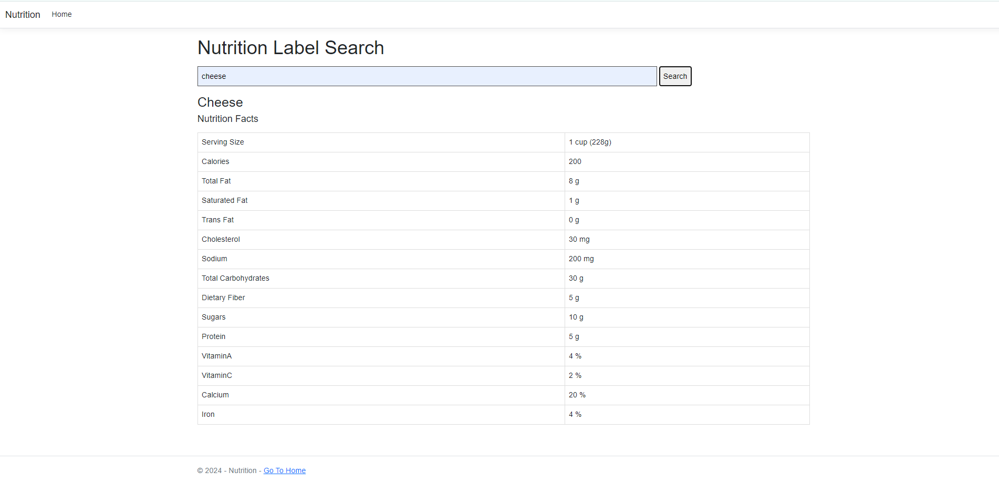

# Nutrition Search
## Description

A nutrition search engine is a specialized tool designed to help users find reliable and specific information related to food, nutrients, diet, and health. 

Unlike general search engines, it focuses on providing curated data about nutrition, dietary guidelines, recipes, or the health benefits of specific foods.

## Key Features

### Food Information Database: 
The search engine typically contains a vast database of foods, nutrients, vitamins, and minerals, offering details like caloric values, macronutrient breakdown (carbohydrates, fats, proteins), and micronutrients (vitamins, minerals).

### Health and Diet Research: 
It allows users to search for health-related information, such as the best diets for managing specific conditions (e.g., diabetes, heart disease) or to learn about how different foods impact wellness.

